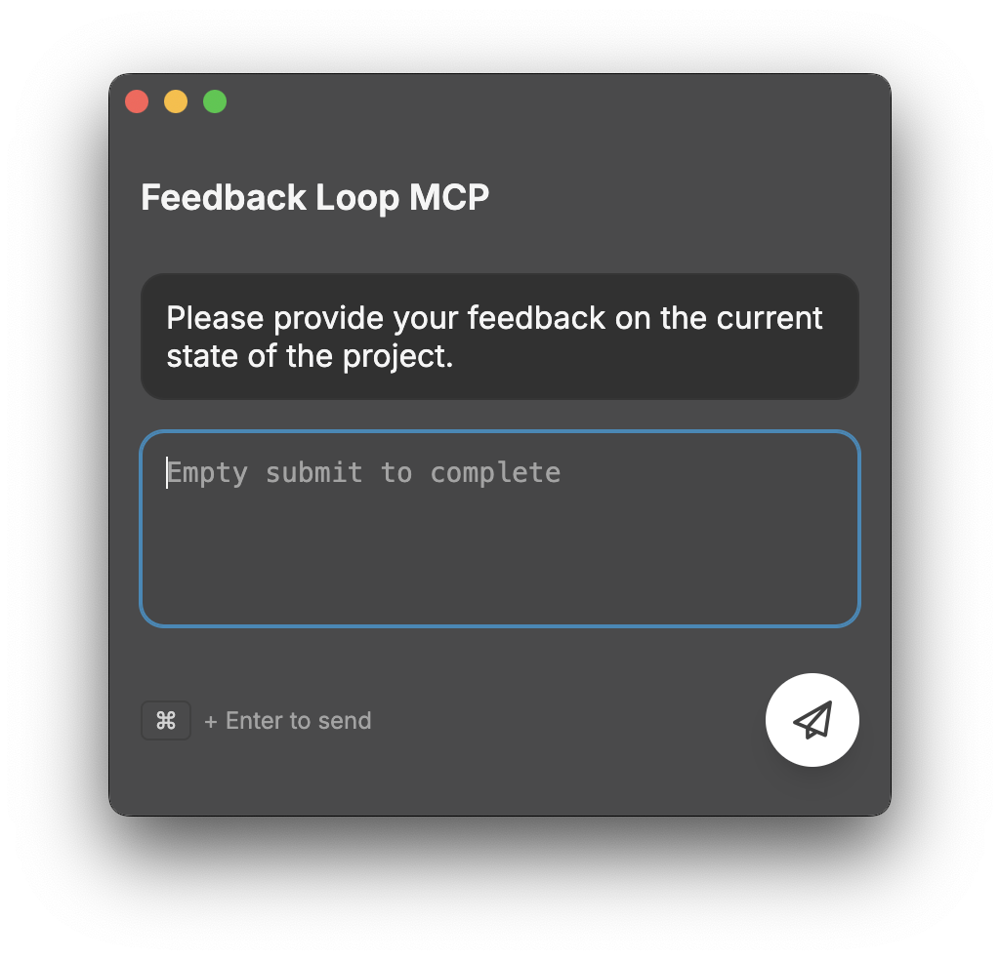

# Feedback Loop MCP

Simple MCP Server to enable a human-in-the-loop workflow in AI-assisted development tools like Cursor. This server allows you to run commands, view their output, and provide textual feedback directly to the AI. It is also compatible with Cline and Windsurf.

> **Inspiration**: This project is inspired by [interactive-feedback-mcp](https://github.com/noopstudios/interactive-feedback-mcp) by Fábio Ferreira (@fabiomlferreira).

## Features

- **Cross-platform**: Works on macOS, Windows, and Linux
- **Interactive UI**: Modern, responsive interface for collecting feedback
- **Settings persistence**: Save and restore UI preferences per project
- **MCP integration**: Seamlessly integrates with MCP-compatible AI assistants
- **macOS overlay support**: Native overlay window support on macOS

## Screenshot



*The feedback collection interface with macOS vibrancy effects*

## Installation

### Quick Start with npx (Recommended)

The easiest way to use this MCP server is via npx:

```bash
npx feedback-loop-mcp
```

### Global Installation

For frequent use, install globally:

```bash
npm install -g feedback-loop-mcp
feedback-loop-mcp
```

### Local Development Setup

For development or customization:

1. Clone the repository:
   ```bash
   git clone <repository-url>
   cd feedback-loop-mcp
   ```

2. Install dependencies:
   ```bash
   npm install
   ```

3. Run in development mode:
   ```bash
   npm run dev
   ```

## MCP Server Configuration

### Cursor IDE

Add the following configuration to your Cursor settings (`mcp.json`):

```json
{
  "mcpServers": {
    "feedback-loop-mcp": {
      "command": "npx",
      "args": ["feedback-loop-mcp"],
      "timeout": 600,
      "autoApprove": [
        "feedback_loop"
      ]
    }
  }
}
```

### Cline / Windsurf

Similar setup principles apply. Configure the server command in your MCP settings:

```json
{
  "mcpServers": {
    "feedback-loop-mcp": {
      "command": "npx",
      "args": ["feedback-loop-mcp"]
    }
  }
}
```

### Claude Desktop

Add to your Claude Desktop configuration:

```json
{
  "mcpServers": {
    "feedback-loop-mcp": {
      "command": "npx",
      "args": ["feedback-loop-mcp"]
    }
  }
}
```

## Usage

### Running the Server

#### Via npx (Recommended)
```bash
npx feedback-loop-mcp
```

#### Via Global Installation
```bash
feedback-loop-mcp
```

#### Local Development
```bash
npm start
```

### Command Line Arguments

The application accepts the following command-line arguments:

- `--project-directory <path>`: Set the project directory
- `--prompt <text>`: Set the initial prompt/summary text

Example:
```bash
npm start -- --project-directory "/path/to/project" --prompt "Please review this code"
```

### Available Tools

The MCP server provides the following tool:

- **`feedback_loop`**: Displays a UI for collecting user feedback and returns the response

Example usage in AI assistants:
```json
{
  "tool_name": "feedback_loop",
  "arguments": {
    "project_directory": "/path/to/your/project",
    "summary": "I've implemented the changes you requested and refactored the main module."
  }
}
```

## Prompt Engineering

For the best results, add the following to your custom prompt in your AI assistant:

```
Whenever you want to ask a question, always call the MCP feedback_loop tool.
Whenever you're about to complete a user request, call the MCP feedback_loop tool instead of simply ending the process.
Keep calling the feedback_loop tool until the user's feedback is empty, then end the request.
```

This ensures your AI assistant uses this MCP server to request user feedback before marking tasks as completed.

## Benefits

By guiding the assistant to check in with the user instead of branching out into speculative, high-cost tool calls, this module can drastically reduce the number of premium requests (e.g., OpenAI tool invocations) on platforms like Cursor. In some cases, it helps consolidate what would be up to 25 tool calls into a single, feedback-aware request — saving resources and improving performance.

Built applications will be available in the `dist` directory.

## Project Structure

```
feedback-loop-mcp/
├── main.js              # Main Electron process
├── preload.js           # Preload script for secure IPC
├── package.json         # Project configuration
├── README.md           # This file
├── assets/             # Static assets
│   └── feedback.png    # Application icon
├── renderer/           # Renderer process files
│   ├── index.html      # Main UI
│   ├── styles.css      # Styling
│   └── renderer.js     # UI logic
└── server/             # MCP server
    └── mcp-server.js   # Node.js MCP server
```

## Configuration

The application automatically saves settings using Electron's built-in storage:

- **General settings**: Window size, position, and UI preferences
- **Project-specific settings**: Command history and project-specific configurations

Settings are stored in the standard application data directory for each platform.

## Features Overview

### Feedback Collection

- Rich text feedback input
- Automatic saving of feedback
- JSON output format for easy integration
- Timestamp and project information included

## Development

For development and build information, see [DEVELOPMENT.md](DEVELOPMENT.md).

## Troubleshooting

### Common Issues

1. **MCP server not connecting**: Ensure the server is running and the configuration is correct
2. **npx command not found**: Make sure Node.js and npm are properly installed
3. **Permission errors**: On Unix systems, you may need to make the binary executable

### Debug Mode

Run with debug output:
```bash
DEBUG=* npx feedback-loop-mcp
```

## License

MIT License - see package.json for details.